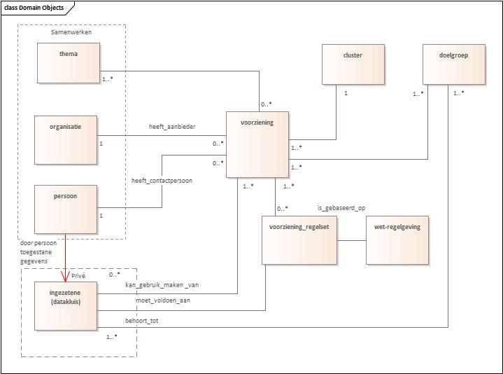

# Niet-normatieve deel

## Introductie

Om gestandaardiseerd metadata uit te wisselen tussen verschillende dataportalen heeft Europa het [[[DCAT-AP-3.0]]] ontwikkeld. [[[DCAT-AP-3.0]]] is gebaseerd op de "Data Catalog Vocabulary" (DCAT) -specificatie [[[DCAT-3.0]]], die wordt ontwikkeld door de Dataset Exchange Working Group. DCAT is een RDF-vocabulaire die ontworpen is om de interoperabiliteit tussen op het web gepubliceerde datacatalogi te vergemakkelijken. Dit profiel faciliteert de uitwisseling van metadata van verschillende domeinen tussen Nederlandse datacatalogi van (semi)overheidsorganisaties op lokaal, regionaal en landelijk nivo en tussen Nederlandse datacatalogi en EU datacatalogi, Het definieert het schema en geeft voorbeelden voor het gebruik ervan.

DCAT stelt een dataprovider in staat om datasets en dataservices in een catalogus te beschrijven met behulp van een standaardmodel en vocabulaire dat het gebruik en de aggregatie van metadata uit meerdere catalogi vergemakkelijkt. Dit kan de vindbaarheid van datasets en dataservices vergroten. Het maakt het ook mogelijk om een gedecentraliseerde benadering te hebben voor het publiceren van datacatalogi en maakt federatief zoeken naar datasets in catalogi op meerdere sites mogelijk met behulp van hetzelfde querymechanisme en dezelfde structuur.

In DCAT worden klassen en eigenschappen van andere gevestigde vocabulaires (ADMS, FOAF) hergebruikt. DCAT maakt gebruik van een bewezen set gemeenschappelijke metadata genaamd "Dublin Core", die in 2009 als ISO 15836-standaard werd gepubliceerd.

Dit document beschrijft het Nederlandse applicatieprofiel op [[[DCAT-AP-3.0]]]. Dit Nederlandse applicatieprofiel - DCAT-AP NL- beantwoordt de vraag over hoe [[[DCAT-AP-3.0]]] in de praktijk wordt toegepast Nederland.

Deze tekst is de introductie van het <a href="https://docs.geostandaarden.nl/dcat/dcat-ap-nl30/" target="_blank">DCAT-AP-NL 3.0</a> toepassingsprofiel .

Doel van dit DCAT profiel is om beschrijvingen van regels te verzamelen in [[[RONL]]] die compatibel zijn met het DCAT-AP-DONL profiel voor [[[DONL]]].

Dit toepassingsprofiel blijft in ontwikkeling. Commentaren, problemen, wensen e.d. kunnen als issue worden gemeld op de <a href="https://github.com/MinBZK/dcat-ap-ronl" target="_blank">Github pagina</a>.

## Producten en diensten

### De Uniforme Productnamenlijst (UPL)

De [[[UPL]]] is een lijst met uniforme naamgeving voor de producten en diensten die de Nederlandse overheid biedt aan burgers en bedrijven. De nadruk daarbij ligt op producten en diensten waarbij er interactie met burgers en bedrijven is, zoals een aanvraag, melding of verplichting. Producten en diensten zoals onderhoud van de groenvoorziening of het wegennet zijn daarom niet in de UPL opgenomen. Iedere overheidsorganisatie is vrij om te bepalen wat haar producten en diensten zijn en welke naam zij daaraan geeft. Met name bij gemeenten zorgt dat voor een veelvoud aan producten en diensten, die eigenlijk in essentie hetzelfde zijn.

Om de vindbaarheid en het hergebruik van productinformatie te verbeteren is de [[[UPL]]] (UPL) ontwikkeld. De lijst zorgt voor synergie in het heterogene productaanbod. De uniforme productnamen worden gebruikt om op een eenduidige manier de productinformatie van de overheid in voorzieningen te integreren, ongeacht bestuurslaag, naamgeving of granulariteit.

### De actuele en historische UPL

De actuele UPL vindt u hier: [[[Volledige-UPL]]].

Omdat het producten- en dienstenaanbod van de Nederlandse overheid regelmatig verandert, wordt de UPL vier keer per jaar bijgewerkt. Daarbij worden soms productnamen als ‘vervallen’ gemarkeerd. In sommige gevallen wordt de productnaam ‘opgevolgd’ door een nieuwe productnaam. Oude productnamen worden nooit weggegooid, maar blijven beschikbaar in de volledige historische productnamenlijst

## Voorzieningen

Voorzieningen, bij de overheid ook wel ‘regelingen’ genoemd, zijn alle vormen van ondersteuning aan inwoners die geboden worden door nationale of gemeentelijke overheden en charitatieve instellingen. Het vindbaar maken van voorzieningen en het vereenvoudigen van het doen van een aanvraag dragen bij aan het gebruik maken van deze voorzieningen.

### Harmonisator

In het eerste halfjaar 2022 is er een onderzoek uitgevoerd naar een Gemeentelijk Gegevenswoordenboek (GGw). Daarbij werd een grote verscheidenheid aan gegevensstructuren zichtbaar op tal van plaatsen in de informatievoorziening van de overheid. De behoefte aan "harmonisatie" van al deze modellen kwam duidelijk naar voren, waartoe het concept van de "Harmonisator" is ontwikkeld. Ook de Voorzieningen zoals bedoeld door [[[RONL]]] steunen op gegevensstructuren. Het eindverslag van dat verkennend onderzoek naar het GGw is [hier](./media/Rapport-GGw-1-0.pdf) te vinden.

### MVP

We maakten een kleine Voorzieningen-applicatie en API, op grond van voorbeelden van de gemeente Vught. Zo wordt de samenhang zichtbaar tussen de aanpak van de "Harmonisator" en de ontwikkeling van een generiek bruikbare en duurzame Voorzieningen-applicatie, die aansluit op de principes en het gedachtegoed van [[[RONL]]]. De kern hiervan is dat eerst de begrippen, relaties en definities helder zijn vastgelegd, als stevig fundament voor tal van toepassingen van gegevens- en informatiegebruik.

De objecttypen en hun samenhang bij Voorzieningen. Een voorziening doorloopt een levenscyclus langs de weg: behoefte, ontwikkeling, aanbieding/promotie, aanvraag, gebruik, bijstelling en afbouw.

- Gegevens van organisaties en personen (actoren) kunnen uit het generieke gegevensmodel 'Samenwerken' (coöperatie, afkorting 'co') worden gehaald.
- De categorisering en clustering van voorzieningen kan volgens standaard thema-indelingen, b.v. van [[[DONL]]] worden toegepast.

Het model is voorbereid op het toepassen van regels op de beschikbaarheid van een voorziening ([[[RONL]]]).

- De gegevens over de rechten op een voorziening worden in de entiteit 'Voorziening_Regelset' opgenomen.
- De entiteit 'Ingezetene' fungeert als (toekomstige) datakluis, mogelijk volgens principes van [NL Wallet](https://github.com/MinBZK/nl-wallet-demo-app).

### Demo

Er is een [demo-omgeving](https://www.ccoverheid.nl/demo/voorzieningen/menu/) voor de voorzieningen-toepassing. Deze Scriptcase- applicatie gebruikt een kopie van de database in de ontwikkelomgeving. De structuur en inhoud kan/zal - zonder aankondiging vooraf - geregeld worden gewijzigd. Je kan dus om te testen wel records aanmaken of wijzigen maar deze worden niet definitief bewaard. Met de API kan je dan al deze gegevens ophalen, toevoegen of wijzigen.
