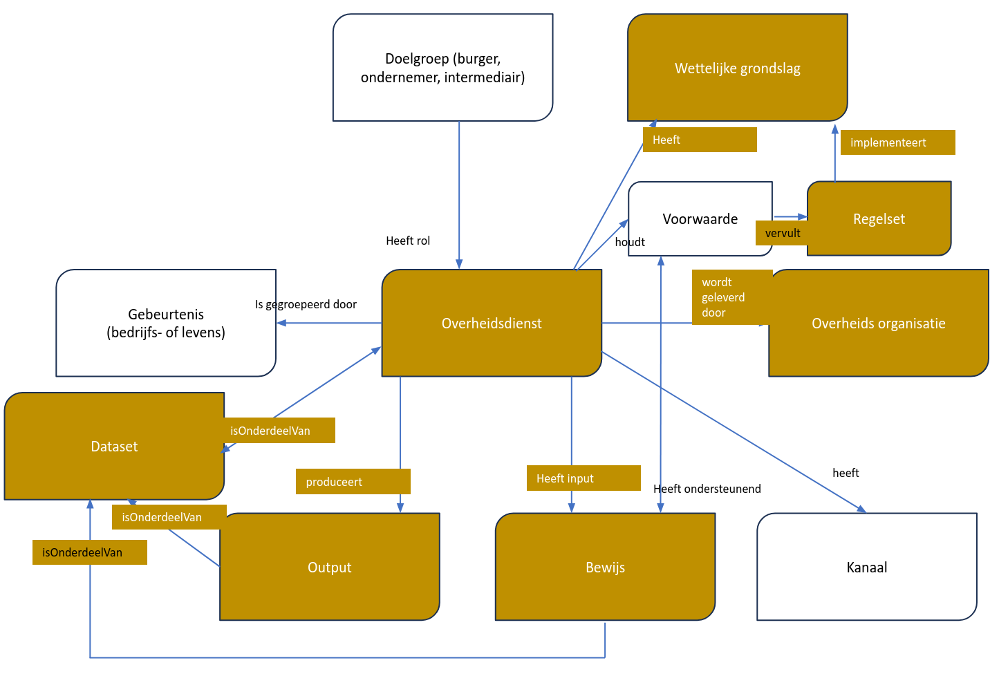

# Niet-normatieve deel

## Introductie
### DCAT-AP NL

Om gestandaardiseerd metadata uit te wisselen tussen verschillende dataportalen heeft Europa het [[[DCAT-AP-3.0]]] ontwikkeld. [[[DCAT-AP-3.0]]] is gebaseerd op de "Data Catalog Vocabulary" (DCAT) -specificatie [[[DCAT-AP-3.0]]], die wordt ontwikkeld door de Dataset Exchange Working Group. DCAT is een RDF-vocabulaire die ontworpen is om de interoperabiliteit tussen op het web gepubliceerde datacatalogi te vergemakkelijken. Dit profiel faciliteert de uitwisseling van metadata van verschillende domeinen tussen Nederlandse datacatalogi van (semi)overheidsorganisaties op lokaal, regionaal en landelijk nivo en tussen Nederlandse datacatalogi en EU datacatalogi, Het definieert het schema en geeft voorbeelden voor het gebruik ervan.

DCAT stelt een dataprovider in staat om datasets en dataservices in een catalogus te beschrijven met behulp van een standaardmodel en vocabulaire dat het gebruik en de aggregatie van metadata uit meerdere catalogi vergemakkelijkt. Dit kan de vindbaarheid van datasets en dataservices vergroten. Het maakt het ook mogelijk om een gedecentraliseerde benadering te hebben voor het publiceren van datacatalogi en maakt federatief zoeken naar datasets in catalogi op meerdere sites mogelijk met behulp van hetzelfde querymechanisme en dezelfde structuur.

In DCAT worden klassen en eigenschappen van andere gevestigde vocabulaires (ADMS, FOAF) hergebruikt. DCAT maakt gebruik van een bewezen set gemeenschappelijke metadata genaamd "Dublin Core", die in 2009 als ISO 15836-standaard werd gepubliceerd.

Dit document beschrijft het Nederlandse applicatieprofiel op [[[DCAT-AP-3.0]]]. Dit Nederlandse applicatieprofiel - DCAT-AP NL- beantwoordt de vraag over hoe [[[DCAT-AP-3.0]]] in de praktijk wordt toegepast Nederland.

Deze tekst is de introductie van het <a href="https://docs.geostandaarden.nl/dcat/dcat-ap-nl30/" target="_blank">DCAT-AP-NL 3.0</a> toepassingsprofiel .

### Doel DCAT-AP-RONL

Het doel van dit DCAT-AP-RONL profiel is om beschrijvingen van regels te verzamelen in [[[RONL]]] die compatibel zijn met het [[[DCAT-AP-NL-3.0]]] profiel voor [[[DONL]]].

Dit toepassingsprofiel blijft in ontwikkeling. Commentaren, problemen, wensen e.d. kunnen als issue worden gemeld op de <a href="https://github.com/MinBZK/dcat-ap-ronl" target="_blank">Github pagina</a>.

## Producten en diensten

### European Legislation Identifier (ELI)

De European Legislation Identifier (ELI) is een systeem om wetgeving online beschikbaar te maken in een gestandaardiseerd formaat, zodat deze over de grenzen heen toegankelijk, uitgewisseld en hergebruikt kan worden. Dit initiatief, gezamenlijk genomen door de EU-landen en instellingen, is vastgelegd in de conclusies van de Raad van 6 november 2017 over de Europese wetgevingsidentificatiecode ([2017/C 441/05](https://eur-lex.europa.eu/legal-content/EN/TXT/?uri=CELEX:52017XG1222(02))).

ELI is gebaseerd op een vrijwillige overeenkomst tussen de EU-landen. Het bevat technische specificaties over:
- web-ID's (URI's) voor juridische informatie
- metadata die specificeren hoe juridische informatie moet worden beschreven
- een specifieke taal voor het uitwisselen van wetgeving in machinaal leesbare formaten

<aside class="note">

Naarmate ELI vooruitgang boekt in de richting van het meer herbruikbaar maken van juridische metadata, onderzoeken we bij de verdere totstandkoming van dit profiel óf en hoe compliancy met ELI-metadata te realiseren valt.

</aside>

### Core Public Service Vocabulary Application Profile 

Alle diensten van de overheid zien er in de kern hetzelfde uit. In de figuur hieronder zie je wat van de kenmerken van overheidsdiensten, die we tot nu toe allemaal op onze eigen manier vastleggen. Neem notie van de **Dataset** aan de Output kant én **Regelset** bij de Wettelijke grondslag en Voorwaarde.

De [[[CPSV-AP]]] is een herbruikbare en gemeenschappelijke dataset om Europese overheidsdiensten te beschrijven. Het doel is om de beschrijving van publieke diensten te harmoniseren en een goed niveau van interoperabiliteit te garanderen. Het is een EC-oplossing.

In Nederland vullen we dat in met de [[[SC]]] en [[[UPL]]]; plus de voorzieningen voor [[[SDG]]]. Die zijn gebaseerd op een Europees metamodel.

### Samenwerkende Catalogi

De [[[SC]]] is een set afspraken over het uitwisselen van informatie over producten en diensten van de overheid op het internet. Door productinformatie te labelen met afgesproken labels en waarden kan deze hergebruikt worden. Zo kan bijvoorbeeld een gemeente ook producten en diensten van de provincie, het waterschap of het Rijk op de eigen website aanbieden.

Overheidsorganisaties publiceren informatie over hun productie en diensten volgens de Samenwerkende Catalogi-standaard. Dit betekent dat zij een product of dienst binnen hun eigen website de juiste metadata geven en op een machine-leesbare wijze beschikbaar stellen volgens deze standaard.

Deze informatie wordt dagelijks verzameld in een landelijke virtuele catalogus. Deze catalogus, die informatie over ruim 50.000 producten en diensten bevat, is dus altijd up-to-date. Deze catalogus is vervolgens te raadplegen via een open koppelvlak (API) zodat deze functionaliteit in elke website of voorziening kan worden geïntegreerd.

### De Uniforme Productnamenlijst (UPL)

De [[[UPL]]] is een lijst met uniforme naamgeving voor de producten en diensten die de Nederlandse overheid biedt aan burgers en bedrijven. De nadruk daarbij ligt op producten en diensten waarbij er interactie met burgers en bedrijven is, zoals een aanvraag, melding of verplichting. Producten en diensten zoals onderhoud van de groenvoorziening of het wegennet zijn daarom niet in de UPL opgenomen. Iedere overheidsorganisatie is vrij om te bepalen wat haar producten en diensten zijn en welke naam zij daaraan geeft. Met name bij gemeenten zorgt dat voor een veelvoud aan producten en diensten, die eigenlijk in essentie hetzelfde zijn.

Om de vindbaarheid en het hergebruik van productinformatie te verbeteren is de [[[UPL]]] (UPL) ontwikkeld. De lijst zorgt voor synergie in het heterogene productaanbod. De uniforme productnamen worden gebruikt om op een eenduidige manier de productinformatie van de overheid in voorzieningen te integreren, ongeacht bestuurslaag, naamgeving of granulariteit.

De actuele UPL vinden we hier: [[[Volledige-UPL]]].

Omdat het producten- en dienstenaanbod van de Nederlandse overheid regelmatig verandert, wordt de UPL vier keer per jaar bijgewerkt. Daarbij worden soms productnamen als ‘vervallen’ gemarkeerd. In sommige gevallen wordt de productnaam ‘opgevolgd’ door een nieuwe productnaam. Oude productnamen worden nooit weggegooid, maar blijven beschikbaar in de volledige historische productnamenlijst

## De LegitiMaat

In opdracht van het ministerie van BZK hebben experts [[[LM]]] ontwikkeld. Dit is een visitatie-instrument om de geautomatiseerde uitvoering van wetten door de overheid op een gestandaardiseerde manier inzichtelijk te maken en te (laten) beoordelen. [[[LM]]] gaat uit van drie perspectieven: juridisch, ontwikkel en accountperspectief.

### Het bereik van De LegitiMaat

[[[LM]]] gaat het om het gehele proces van wet tot aan individueel besluit en daarna, reactie van de ontvangers (telefoontjes, klachten, bezwaren) en de keteneffecten. Het is maatschappelijk zeer relevant dat dit proces beter inzichtelijk wordt. Daarmee verhogen we de transparantie. Met [[[LM]]] kan beoordeeld worden of de wetten, de algemene beginselen van behoorlijk bestuur en het verbod van discriminatie zijn nageleefd.

Als de overheid besluiten neemt in individuele gevallen waarbij het gaat om grote aantallen en veel vergelijkbare repeterende taken, gaat dit vaak geautomatiseerd. Hiervoor moet de wet vertaald worden en moet bepaald worden hoe de wet wordt uitgevoerd. Na gesprekken met de professionals hebben we dit proces in de volgende stappen onderscheiden.

Deze procesplaat is een illustratie, geen voorschrift. Elke organisatie zal het proces op een eigen manier hebben ingericht. Dat blijft in stand. De procesplaat en de onderverdeling in [[[LM]]], is een manier om het gesprek te voeren én zijn een opmaat voor de standaardisatie van metadateren van regelspecificatie sets m.b.v. dit applicatieprofiel.

### Aanpak

Verplichte velden voor [[[RONL]]] over de linkerkant van de flow zijn relaties met wetgeving, maar er kunnen 3 extra relaties zijn:
- uitvoeringsbeleid (bron: [[?PUC]], eigen website organisatie)
- analyseren (zoals gepubliceerd in analysetools, wetsanalyse-editors, enz.)
- werkinstructies (gepubliceerd in [[?PUC]] of online in handboeken)

Voor de items aan de rechterkant van de stroom moeten we een klasse distributie aanbieden om te beschrijven:
- functionele ontwerpen / koppelingen naar functionele ontwerpen in een Git-based-register (documentatie)
- algoritmes / code / applicaties waar regels worden uitgevoerd, gepubliceerd in een Git-based-register (uitvoering)
- handmatige procedures; grotendeels intern gepubliceerd (procesbeschrijvingen)

Het is belangrijk om vast te stellen: wat wordt opgeslagen/beschreven als onderdeel van de regelspecificatie set en waaraan kan worden gekoppeld.
- Hieruit volgt dat alle objecten aan de linkerkant van regels in de stroom moeten worden gekoppeld.
- Alle objecten aan de rechterkant kunnen deel uitmaken van de regelspecificatie set.

Elke regelspecificatie set heeft een URI nodig die kan worden gebruikt om te linken in openbare communicatie/brieven.
